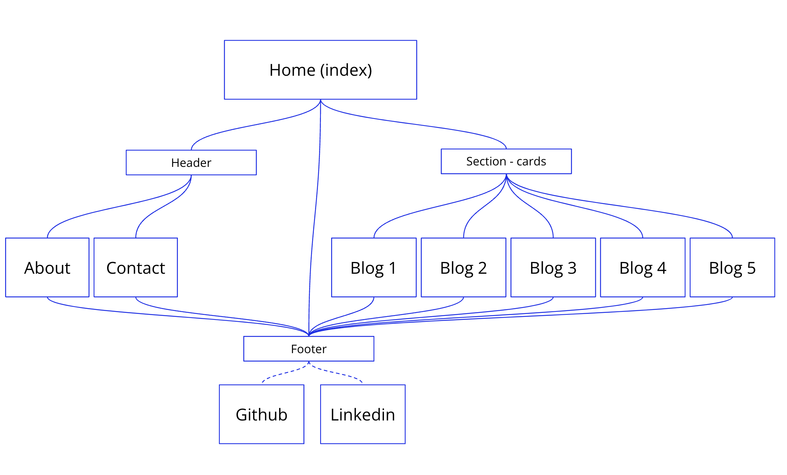
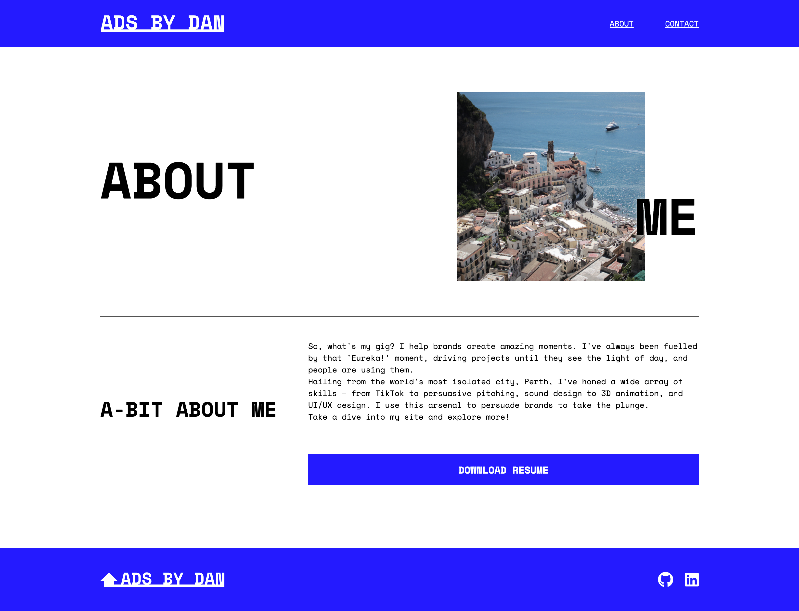
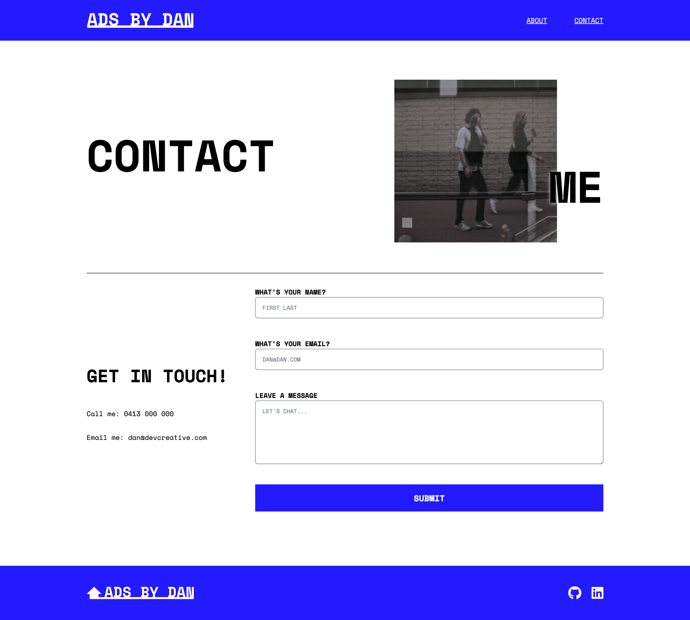

## DANIEL CRAIG - Term 1, Assignment 2
#### A link (URL) to your published portfolio website
* View the published site here: https://effulgent-nougat-898eef.netlify.app/

#### A link to your GitHub repo
* View the Github repo here: https://github.com/14947/DanielCraig_T1A2

#### A link to your presentation video
* View the video here: https://youtu.be/xxVH6xPCuNU?feature=shared
* I go into the depth of developing this site in the deck. View the slide deck here: https://docs.google.com/presentation/d/1G4G5I16S44fny-sZxl8TExMYByQ8_HCsAtJNXVrj0-E/edit?usp=sharing

#### Description of your portfolio website, including,

#### Purpose
* The purpose of this website is present myself a professional dev. It shows my skills as an advertising art director / designer but it is set up so I can add my dev projects as I go. It currently shows my latests projects.

#### Functionality / features
* It features a home page, 5 blogs, contact us & an about page. It features easy navigation and interactions for the user as well as an interactive contact form, downloadable resume and links to my socials

#### Target audience
* I currently work in advertising - I see a gap in creative and software, I want to either work at a startup working on the product as well as the creative, an ad agency working in the digital side of things or an ecom brand where I also work on the product as well as the creative.

#### Tech stack (e.g. html, css, deployment platform, etc)
* HTML
* CSS
* SASS
* Netlify
* Github
* Bash

#### Reference

* W3Schools (2022). HTML Tutorial. [online] W3schools.com. Available at: https://www.w3schools.com/html/default.asp.

* Mozilla (2019). CSS: Cascading Style Sheets. [online] MDN Web Docs. Available at: https://developer.mozilla.org/en-US/docs/Web/CSS.

* fontawesome.com. (n.d.). Find the Perfect Icon for Your Project | Font Awesome. [online] Available at: https://fontawesome.com/search.

#### Sitemap

#### Screenshots

